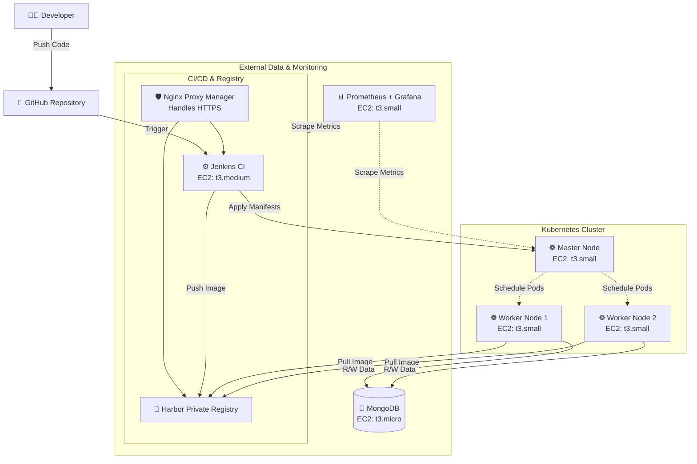

Youtube video: https://youtu.be/jYnSpkf99Do

# MERN ToDo App: CI/CD, Kubernetes, and AWS Infrastructure

This repository contains the infrastructure as code (IaC), configuration management, and deployment manifests for a MERN-stack ToDo application. 

The project focuses on building a secure, private, and monitored DevOps environment using AWS EC2 instances. It features a private container registry (Harbor), automated builds via Jenkins, orchestration with Kubernetes, externalized MongoDB, and basic hardware monitoring using Prometheus and Grafana.

## System Architecture

The infrastructure is provisioned on AWS using Terraform. To ensure consistent IaC execution, Terraform and Ansible are packaged within a dedicated Docker container, eliminating local environment dependencies.

| Server Role | EC2 Type | Storage | Responsibility |
|---|---|---|---|
| **Jenkins & Harbor** | `t3.medium` | 30GB gp3 | Hosts the CI/CD pipeline and private container registry. Nginx Proxy Manager is used to provide HTTPS endpoints. |
| **K8s Master Node** | `t3.small` | Default | Kubernetes control plane. |
| **K8s Worker Nodes (x2)** | `t3.small` | Default | Runs the MERN application workloads. |
| **MongoDB** | `t3.micro` | Default | Dedicated external database for the application. |
| **Monitoring** | `t3.small` | Default | Runs Prometheus and Grafana to track hardware metrics. |