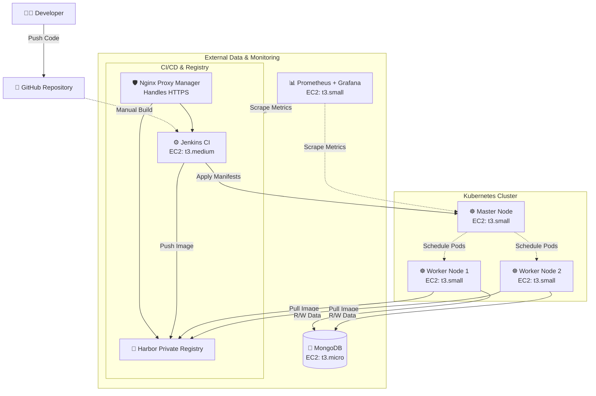

Youtube video: https://youtu.be/jYnSpkf99Do

# MERN ToDo App: CI/CD, Kubernetes, and AWS Infrastructure


This repository contains the infrastructure as code (IaC), configuration management, and deployment manifests for a MERN-stack ToDo application. 

The project focuses on building a secure, private, and monitored DevOps environment using AWS EC2 instances. It features a private container registry (Harbor), automated builds via Jenkins, orchestration with Kubernetes, externalized MongoDB, and basic hardware monitoring using Prometheus and Grafana.

## System Architecture

The infrastructure is provisioned on AWS using Terraform. To ensure consistent IaC execution, Terraform and Ansible are packaged within a dedicated Docker container, eliminating local environment dependencies.



| Server Role | EC2 Type | Storage | Responsibility |
|---|---|---|---|
| **Jenkins & Harbor** | `t3.medium` | 30GB gp3 | Hosts the CI/CD pipeline and private container registry. Nginx Proxy Manager is used to provide HTTPS endpoints. |
| **K8s Master Node** | `t3.small` | Default | Kubernetes control plane. |
| **K8s Worker Nodes (x2)** | `t3.small` | Default | Runs the MERN application workloads. |
| **MongoDB** | `t3.micro` | Default | Dedicated external database for the application. |
| **Monitoring** | `t3.small` | Default | Runs Prometheus and Grafana to track hardware metrics. |

Note: An AWS Budget is configured via Terraform to send an email alert if monthly costs exceed $30 USD.

## Deployment Lifecycle
sequenceDiagram
    participant Dev as Developer
    participant Git as GitHub
    participant Jen as Jenkins
    participant Har as Harbor
    participant K8s as Kubernetes
    
    Dev->>Git: Push application code
    Git->>Jen: Webhook trigger
    Jen->>Jen: Build Docker Images (FE & BE)
    Jen->>Har: Push tagged images to private registry
    Jen->>K8s: Apply deployment manifests
    K8s->>Har: Authenticate & Pull latest images
    K8s->>K8s: Perform rolling update

## Repository Map

| Path | Responsibility |
|---|---|
| `mern-todo-app/frontend/` | React frontend application source code. |
| `mern-todo-app/backend/` | Node.js and Express backend API source code. |
| `mern-todo-app/Jenkinsfile` | CI/CD pipeline configuration for Jenkins to build Docker images and push them to Harbor. |
| `k8s-todolist/` | Kubernetes YAML manifests (`frontend-deploy.yaml`, `backend-deploy.yaml`) for deploying workloads to the cluster. |
| `terraform_and_ansible/terraform/` | IaC scripts to provision AWS EC2 instances, configure Security Groups, and set up AWS Budgets alerts. |
| `terraform_and_ansible/ansible/` | Configuration management playbooks and inventory settings to bootstrap the Kubernetes cluster (Master & Workers). |
| `terraform_and_ansible/Dockerfile` | Dockerfile to build an isolated operations environment pre-installed with Terraform, Ansible, and required dependencies. |

## End-to-End Deployment Flow

The following steps describe the complete lifecycle from a code commit to a live application:

1. **Code Commit:** A developer pushes a new feature or bug fix to the GitHub repository.
2. **Manual CI Trigger:** The developer manually triggers the "Build Now" action for the pipeline within the Jenkins UI. *(Note: GitHub Webhook automation is planned for future iterations).*
3. **Build Stage (Jenkins):** - Jenkins clones the latest source code from the repository.
   - It builds two separate Docker images: one for the React Frontend and one for the Node.js Backend.
4. **Push to Registry:** Jenkins securely logs into the private Harbor registry and pushes the newly built images with specific version tags.
5. **Deployment (CD):** - Jenkins connects to the Kubernetes Master node.
   - It executes `kubectl apply` commands using the `frontend-deploy.yaml` and `backend-deploy.yaml` manifests to update the deployment state in the cluster.
6. **Orchestration & Image Pull:** - The K8s Master node schedules the new Pods onto the Worker nodes.
   - The Worker nodes authenticate with Harbor and pull the latest Docker images to start the application containers.
7. **Runtime & Monitoring:** - The frontend serves traffic, and the backend processes requests, reading/writing data to the external MongoDB instance.
   - In the background, Prometheus continuously scrapes CPU and RAM metrics from the CI/CD server and K8s Master, which can be visualized in Grafana.

## Setup & Deployment Guide

This project is currently a work in progress. While the full pipeline is not yet 100% zero-touch, the infrastructure provisioning is highly automated.

### 1. Provisioning Infrastructure (Terraform & Ansible)

To avoid local dependency issues, all Terraform and Ansible operations are run inside a pre-configured Docker container.

1. Navigate to the Infrastructure as Code (IaC) directory:
   ```bash
   cd terraform_and_ansible
   ```

2. Build the operations container:
   ```bash
   docker build -t devops-ops-env .
   ```

3. Run the container interactively (mounting your local AWS credentials and current directory):
   ```bash
   docker run -it -v $(pwd):/workspace -v ~/.aws:/root/.aws devops-ops-env sh
   ```

4. Inside the container, initialize and apply Terraform to provision the EC2 instances:
   ```bash
   cd terraform
   terraform init
   terraform plan
   terraform apply -auto-approve
   ```
   *(Note: This will output the public IPs for all 6 created instances upon completion).*

### 2. Configuration & Application Deployment

1. **DNS & HTTPS:** Access the Nginx Proxy Manager UI (running on the Jenkins/Harbor instance) to route your domain names and issue SSL certificates for Jenkins and Harbor.
2. **Kubernetes Cluster Bootstrap:** Update your Ansible inventory with the newly provisioned EC2 IPs. Run the provided Ansible playbooks to bootstrap the Master node and join the Worker nodes to the cluster.
3. **Application Deployment:** Update the `frontend-deploy.yaml` and `backend-deploy.yaml` with your Harbor registry URL and image tags. Apply them to the cluster:
   ```bash
   cd ../k8s-todolist
   kubectl apply -f frontend-deploy.yaml
   kubectl apply -f backend-deploy.yaml
   ```

## Security & Secrets

* Private images are securely stored in Harbor, requiring authentication from the K8s cluster to pull.
* HTTPS is enforced for CI/CD and Registry interfaces via Nginx Proxy Manager.
* Never commit `.tfstate` files, AWS credentials, or private SSH keys. Ensure `.gitignore` is strictly followed.

